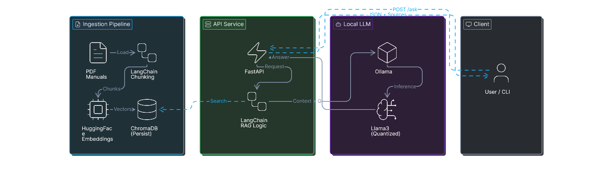
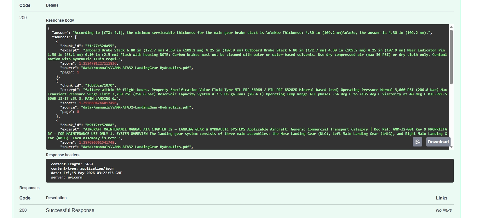

<div align="center">

# TechDocs-LLMOps

**Local, air-gap–friendly RAG over technical PDFs** — ingest manuals, embed on CPU with sentence-transformers, persist vectors in Chroma, answer with Ollama via a small **FastAPI** surface.

[](https://www.python.org/)
[](https://fastapi.tiangolo.com/)
[](https://www.langchain.com/)
[](https://www.trychroma.com/)
[](https://ollama.com/)

[Repository](https://github.com/momo-s15/techdocs-llmops) · [Quick start](#quick-start-windows) · [API](#api) · [Architecture](#architecture)

</div>

---

## Why this exists

Technical documentation is dense, versioned, and often **cannot** be sent to third-party LLM APIs. This project demonstrates an end-to-end pattern teams actually care about: **private retrieval**, **reproducible ingestion**, **observable health checks**, and a **thin HTTP API** suitable for operators or downstream tools — without cloud keys in the default path.

---

## Table of contents

- [What you get](#what-you-get)
- [Architecture](#architecture)
- [Stack](#stack)
- [Skills this project demonstrates](#skills-this-project-demonstrates-for-recruiters--hiring-managers)
- [Quick start (Windows)](#quick-start-windows)
- [Sample API response](#sample-api-response)
- [Alternative: helper scripts](#alternative-helper-scripts)
- [Health checks](#health-checks)
- [Configuration](#configuration)
- [Air-gap and privacy](#air-gap-and-privacy)
- [Ollama CUDA errors on Windows](#ollama-cuda-errors-on-windows)
- [Restart after CLI ingest](#restart-after-cli-ingest)
- [Tests](#tests)
- [Project layout](#project-layout)
- [Limitations (v1)](#limitations-v1)

---

## What you get

| Capability | Detail |
|------------|--------|
| **PDF ingestion** | LangChain `PyPDFLoader` + `RecursiveCharacterTextSplitter`; CLI at `scripts/ingest.py` with optional collection reset |
| **Embeddings** | HuggingFace / sentence-transformers on **CPU** by default (no paid embedding API) |
| **Vector store** | Chroma with **on-disk** persistence (`CHROMA_PERSIST_DIR`) |
| **Generation** | Grounded answers via **langchain-ollama** `ChatOllama` with retrieval-augmented prompts and cited **sources** in the response |
| **API** | FastAPI: `GET /`, OpenAPI docs, `POST /v1/ask`, guarded optional `POST /v1/reindex` |
| **Operations** | Structured logging, `/health` and `/health/ollama`, clear **503** payloads when the LLM path fails |
| **Quality** | Pytest suite with `TECHDOCS_TESTING` + `FakeEmbeddings` so CI/local tests avoid heavy model downloads |

---

## Architecture

End-to-end flow (reference diagram in the repository root). The image is scaled to use the full width of the README column on GitHub.

<div align="center">
  
</div>

Data stays on your machine: **no cloud LLM or embedding API** in the default configuration.

---

## Stack

| Layer | Technology |
|-------|------------|
| Runtime | Python 3.10+ |
| Web | FastAPI, Uvicorn, Pydantic v2, pydantic-settings |
| RAG | LangChain (community, Chroma, Ollama, text-splitters, core) |
| Vectors | ChromaDB |
| Embeddings | sentence-transformers |
| Documents | pypdf |
| Local LLM | Ollama (HTTP client via langchain-ollama / httpx) |
| Tests | pytest, pytest-asyncio |

---

## Skills this project demonstrates (for recruiters & hiring managers)

If you are reviewing this repository in a hiring context, here is the **mapping from repo to role expectations**:

- **LLM application design**: RAG (retrieve → augment → generate), top-k retrieval, grounded prompts, structured response with **sources** for auditability.
- **MLOps / LLMOps awareness**: separation of **ingestion** (batch/CLI) vs **serving** (API), persistence of embeddings, health endpoints, environment-driven configuration.
- **Privacy & compliance posture**: local inference path, air-gap–friendly caches, no secrets in the repo (`.env` gitignored; `.env.example` only).
- **Production-shaped API habits**: OpenAPI, explicit error semantics (e.g. **503** with actionable `detail` when Ollama is unavailable), optional dangerous routes gated by config (`ENABLE_REINDEX_API`).
- **Software engineering**: typed settings, package layout under `src/`, automated tests with test doubles (`FakeEmbeddings`), Windows-first operator notes.

---

## Quick start (Windows)

From the project root:

```powershell
python -m venv .venv
.\.venv\Scripts\Activate.ps1
pip install -e ".[dev]"
copy .env.example .env
```

Place PDF manuals under `data\manuals\` (only `*.pdf` are ingested).

```powershell
python scripts\ingest.py --manuals-dir .\data\manuals --reset-collection
uvicorn techdocs_llmops.api.main:app --reload --host 127.0.0.1 --port 8000
```

Open [http://127.0.0.1:8000/docs](http://127.0.0.1:8000/docs) and call **`POST /v1/ask`** with a JSON body, for example:

```json
{
  "question": "What is the minimum serviceable thickness for the main gear brake stack?",
  "k": 6
}
```

If port **8000** is occupied by a stale process, pick another port or use the helper script below.

---

## Sample API response

With manuals ingested and Ollama running, the same request as in the quick start example above returns a structured payload: an **`answer`** grounded in the manuals plus **`sources`** (excerpts, scores, file paths, and pages). Below is a real capture from **`/docs`** (Swagger UI) for that request.



---

## Alternative: helper scripts

- **`scripts/dev-server.ps1`** — convenience launcher (default port **8010** to avoid collisions with other Uvicorn instances).
- **`scripts/free-port.ps1`** — frees a stuck port on Windows when development servers fail to bind.

---

## Health checks

| Endpoint | Purpose |
|----------|---------|
| `GET /` | Service overview and links |
| `GET /health` | Chroma path and basic application status |
| `GET /health/ollama` | Probes Ollama (`/api/tags`) |

---

## API

| Method | Path | Description |
|--------|------|-------------|
| `POST` | `/v1/ask` | RAG question; returns `answer` and `sources` |
| `POST` | `/v1/reindex` | **Disabled by default**; set `ENABLE_REINDEX_API=true` in `.env` to enable on-host reindexing |

Prefer **`scripts/ingest.py`** for air-gap operations when you can afford a restart; the reindex API is optional convenience.

---

## Configuration

Copy [`.env.example`](.env.example) to `.env` and adjust. Variables are **operational knobs** — the default stack does **not** require cloud API keys.

| Variable | Purpose |
|----------|---------|
| `CHROMA_PERSIST_DIR` | On-disk Chroma persistence |
| `MANUALS_DIR` | Default directory for PDFs |
| `CHROMA_COLLECTION_NAME` | Collection name |
| `EMBEDDING_MODEL` | sentence-transformers model id |
| `CHUNK_SIZE` / `CHUNK_OVERLAP` | LangChain `RecursiveCharacterTextSplitter` |
| `OLLAMA_BASE_URL` | Default `http://127.0.0.1:11434` |
| `OLLAMA_MODEL` | Must match a pulled Ollama model (check `ollama list`) |
| `DEFAULT_TOP_K` | Retrieval depth for `/v1/ask` |
| `ENABLE_REINDEX_API` | `true` to allow `POST /v1/reindex` |

**Ollama model name:** use the exact tag from `ollama list`, for example `llama3:latest`.

---

## Air-gap and privacy

- **No cloud LLM or embedding APIs** in the default path: models run locally (sentence-transformers + Ollama).
- After first install, you can run with **network disabled** once wheels and model weights are cached.
- **Caches to back up or pre-seed** on Windows:
  - Chroma data: directory set by `CHROMA_PERSIST_DIR` (default `./data/chroma`)
  - HuggingFace / sentence-transformers weights: typically under `%USERPROFILE%\.cache\huggingface\`
  - Ollama models: under `%USERPROFILE%\.ollama\models` (see Ollama documentation)

**Do not commit** `.env`, proprietary PDFs, or Chroma databases. This repository is structured so those paths stay out of version control via [`.gitignore`](.gitignore).

---

## Ollama CUDA errors on Windows

If `POST /v1/ask` returns **503** with text like **`CUDA error`** or **`shared object initialization failed`**, the **Ollama** process is failing on the **GPU** path (driver/CUDA stack), not the Python application layer.

1. **Force Ollama to use CPU** (slower, usually stable). In PowerShell (new sessions will see the variable):

   ```powershell
   setx CUDA_VISIBLE_DEVICES "-1"
   ```

   Then **fully quit Ollama** from the **system tray** and start Ollama again. If it still uses the GPU, **sign out of Windows** or **reboot** once so the tray app inherits the variable.

2. **Fix the GPU stack**: install the latest **NVIDIA driver** from NVIDIA or Windows Update, reboot, then remove `CUDA_VISIBLE_DEVICES` if you want GPU acceleration again.

3. **Smaller model** (after GPU works): set `OLLAMA_MODEL=llama3.2:latest` in `.env` to use less VRAM.

Variables in this project’s **`.env`** only affect this app’s HTTP client to Ollama; they do **not** change how Ollama loads CUDA. Ollama reads **Windows user/system environment variables** for that.

---

## Restart after CLI ingest

If the API was already running and you ingest new PDFs with `scripts/ingest.py`, **restart Uvicorn** so in-memory handles pick up the updated index (or use `POST /v1/reindex` with `ENABLE_REINDEX_API=true`).

---

## Tests

Pytest sets `TECHDOCS_TESTING=1` (see [`tests/conftest.py`](tests/conftest.py)) so the API can use `FakeEmbeddings` and avoid downloading HuggingFace weights. [`pyproject.toml`](pyproject.toml) sets `pythonpath = ["src"]` so imports resolve without extra `PYTHONPATH` setup.

```powershell
pytest
```

Do **not** set `TECHDOCS_TESTING` for production serving; it is only for automated tests.

---

## Project layout

| Path | Role |
|------|------|
| [`architecture-diagram.png`](architecture-diagram.png) | Reference architecture diagram (root) |
| [`v1-ask-main-gear-brake-stack-response.jpeg`](v1-ask-main-gear-brake-stack-response.jpeg) | Sample `POST /v1/ask` output (Swagger) for the brake stack question with `k: 6` |
| [`src/techdocs_llmops/`](src/techdocs_llmops/) | Application package: config, ingest, vector store, RAG chain, API |
| [`scripts/ingest.py`](scripts/ingest.py) | CLI ingestion |
| [`scripts/dev-server.ps1`](scripts/dev-server.ps1) | Optional dev server launcher |
| [`tests/`](tests/) | Pytest suite |

---

## Limitations (v1)

- PDF text extraction uses **PyPDF**; complex tables or scanned pages may need a different parser in a future revision.
- Retrieval scores are Chroma distance scores (lower is typically “closer” for L2); treat them as relative ranks.

---

## Maintainer

Portfolio and reference implementation by [@momo-s15](https://github.com/momo-s15) — **TechDocs-LLMOps**.

If you use this in an interview or take-home, be ready to discuss trade-offs: embedding model choice, chunking strategy, evaluation without golden labels, and when to move from local Ollama to a managed inference tier.
